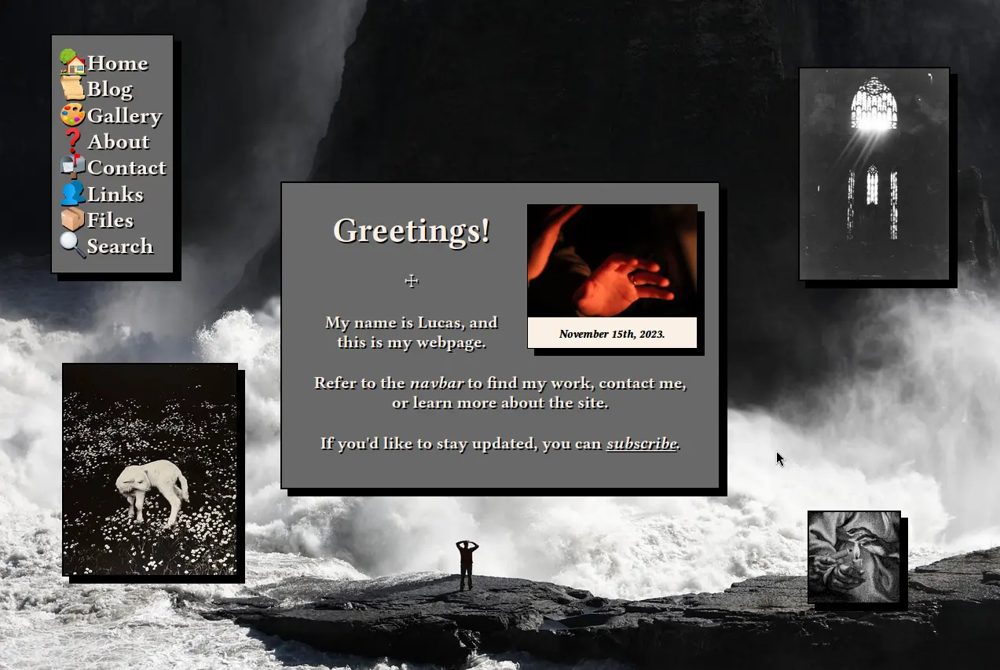

# Latitude: A theme for Hugo



Latitude is a theme for Hugo that I created for my [personal webpage](https://cherub.im).

Special thanks to Luke Smith's [Lugo](https://github.com/Lukesmithxyz/lugo), which was the jumping-off point for how Latitude came to be. Several features from Lugo are present in Latitude.

## Setting Up

```sh
hugo new site new-site
cd new-site
git clone https://github.com/varietygarden/latitude themes/latitude
echo "theme = 'latitude'" >> config.toml
ln -s themes/latitude/static/style.css static/style.css
ln -s themes/latitude/static/mobile.css static/mobile.css
# Bear in mind that when creating symlinks, full file paths are required.
```

## Etc.

- Makes one RSS feed for the entire site at `/index.xml`.
- Stylesheet is in `/style.css` and includes some important stuff for partials.
- Custom CSS optimizations for easier reading on phones via `/mobile.css`.
- If a post is tagged, links to the tags are placed at the bottom of the post.
- `taglist.html` links all tags an article is tagged to for related content.
